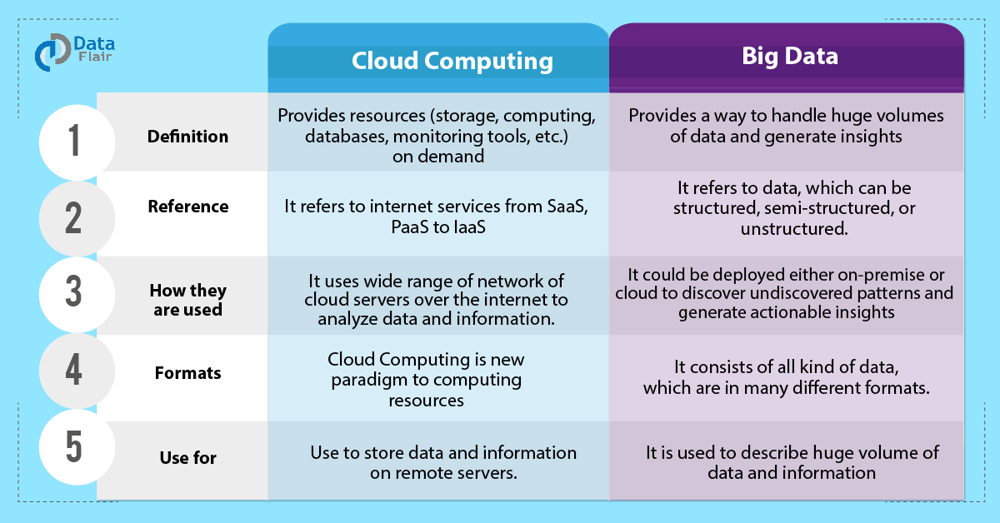
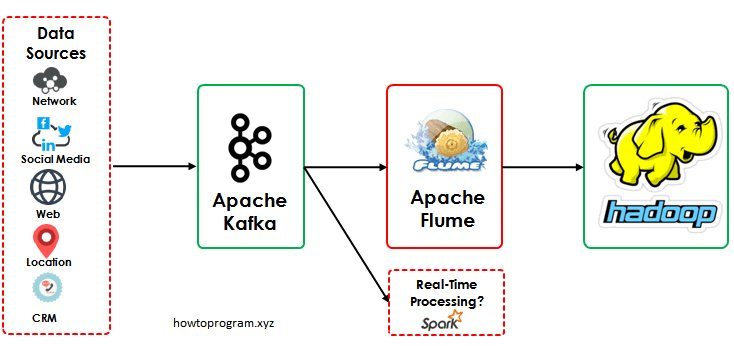
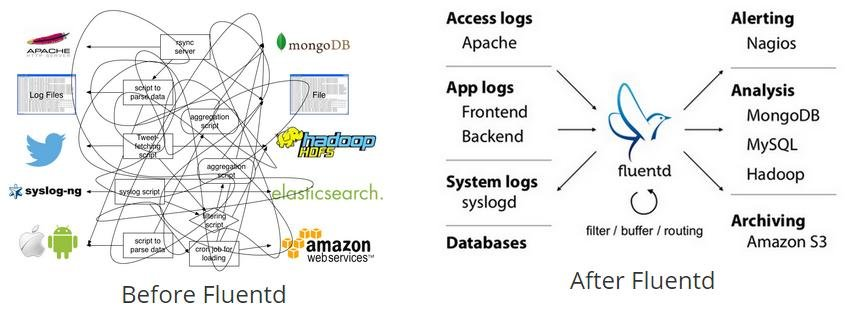
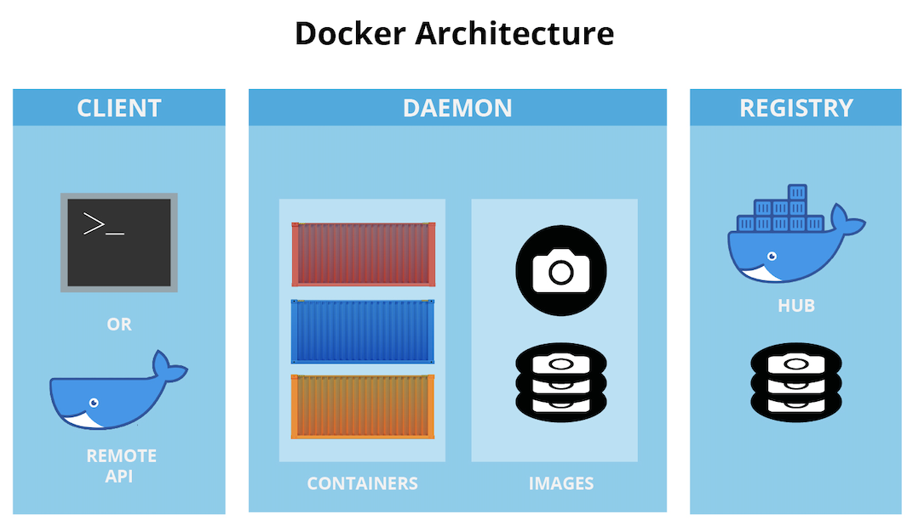
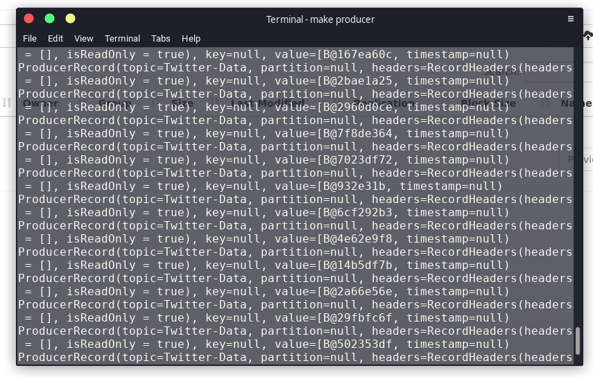
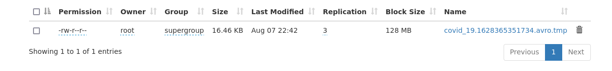

= Διαχείριση Δεδομένων Μεγάλης Κλίμακας
:toc:
:toc-title:
:source-highlighter: rouge
:source-language: java

.ΑΠΑΛΛΑΚΤΙΚΗ ΕΡΓΑΣΙΑ
****************************************************************************
[.text-center]
Αυτό το έγγραφο είναι η αναφόρα της απαλλακτικής εργασίας του μαθήματος Διαχείριση Δεδομένων Μεγάλης Κλίμακας.
****************************************************************************

**Φοιτητής**: +
Μαστρογιαννόπουλος Ιάκωβος, 713242017102

== Θεματολογία Εφαρμογής Ανάλυσης Δεδομένων

=== Ιστορική Αναδρομή του COVID-19

.Θεματολογία εργασίας

Τον Νοέμβριο του 2019, σε μία πόλη της Κίνας ονόματι Wuhan, εμφανίστηκε ο ιός **coronavirus disease 2019** (**COVID-19**, εν συντομία), ο οποίος αργότερα μέσα στον Φεβρουάριο του 2020 ανακηρύχθηκε από τον Παγκόσμιο Οργανισμό Υγείας ως Παγκόσμια Πανδημία, όπου η μεταδόση του από ατόμο σε ατόμο είναι εύκολη, γρήγορη και επικίνδυνη. Οι γιατροί συνιστούσαν την αποφυγή της μάζωξης πολλών ατομών στον ίδιο χωρό, αφήνοντας αποστάσεις μεταξύ τους και την χρήση μάσκας σε δημόσιους χώρους. Οι κυβερνήσεις για να προστατέψουν τους πολίτες, αναγκάστηκαν να τους βάλουν σε καραντίνα με διαφορετικά μέτρα ανά χώρα για έναν χρονικό διάστημα μέχρι να βρεθεί λύση. +
Η λύση αυτή ήταν μία και αυτό ήταν να δημιουργήθει ανοσία στον COVID σε ένα σημαντικό πληθύσμο. Στις 2 Δεκεμβρίου 2020 εγίνε η πρώτη εγκρίση για το εμβόλιο της εταιρείας Pfizer & BioNTech. Στις 8 Δεκεμβρίου πραγματοποίηθηκε η πρώτη δόση εμβολίου κατά του COVID στο Ηνωμένο Βασίλειο. +
Σημέρα, Αύγουστος 2021, έχουν δημιουργηθεί και εγκριθεί τουλάχιστον 10 διαφορετικά εμβολία και έχουν πραγματοποίηθει πάνω από 218 εκατομμύριοι εμβολιασμοί, ενώ πραγματοποιούνται 6 εκατομμύριοι εμβολιασμοί ημερήσιως.

=== Επιπτώσεις στον κόσμο

.Διαδήλωση κατά του COVID 19

Οι ζωές ολών στον πλάνητη είχε αλλάξει. Σχολεία και πανεπιστημία κλείστα, εταιρείες με μειωμένο προσωπικό και τα μαγάζια κλείστα. Για αρκετούς αυτό ήταν πολύ μεγάλη αλλαγή για να αντέξουν. Οι γνώμες διχάζαν από αυτούς που υποστήριζαν ότι ήταν αναγκαίο κακό ολά τα μέτρα ασφάλειας σε αυτούς που φώναζαν για ελλειψη ελευθερίας και "τσιπάκια 5G" μέσα στα εμβόλια.

.Ιστοσελίδες **Κοινωνικών Ιστοσελίδων** (**Social Media**)

Ανεξαρτήτως των γνώμων, αρκετοί βρήκαν την φωνή τους μέσω των social media. Ένα εργαλείο που κάποτε χρησιμοποίουταν παραπάνω για καθημερινή χρήση, χρησιμοποιήθηκε για νέους λόγους για πολλούς. Αρκετά γκρουπ κανονίζανε πορείες και διαμαρτυρίες μέσω τέτοιων ιστοσελίδων.

.Το Twitter είναι μία από τις ιστοσελίδες που διαμοιράζονται οι γνώμες για τον COVID-19
image::img/twitter.png[Το logo του Twitter]

Στην συγκεκριμένη εργασία, θα ανακτηθούν πληροφορίες από μία ιστοσελίδα social media, το Twitter και θα γίνει παραγωγή νέων δεδομένων με βάση των στατιστικών δεδομένων. Το Twitter είναι διάσημο για την ελευθερία λόγου μέσα στην πλατφόρμα του.

=== Δεδομένα μεγάλης κλιμάκας

.Τα **δεδομένα μεγάλης κλιμάκας** (**big data**) είναι παντού

Ο όρος **δεδομένα μεγάλης κλίμακας** (**big data**) δεν είναι τίποτα αλλό, παρά μία συλλόγη από δεδομένα σε πελώρια μεγέθη (πολλά παραπανώ από το 100 TB). Το Twitter είναι υπεύθυνο για την συλλογή και επεξεργασίας τέτοιων δεδομένων καθημερίνα. +
Για να φτιαχτούν τέτοιες εφαρμογές εύκολα και απλά, χρησιμοποιούνται τεχνικές από την **Υπολογιστική Νέφους** (**Cloud Computing**). Το cloud computing σημαδεύει στο να παρέχει πόρους και υπηρεσίες on-demand και flexible. Ένας Cloud μηχανικός μπορεί να συνδέσει τις γνώσεις του με την **εικονικοποίηση** (**Virtualization**) για να φτιάξει μία υπηρεσία που θα συλλέγει, θα επεξεργάζεται, θα αποθηκεύει και θα παρουσιάζει big data.

.Διαφορές Big Data και Cloud Computing
[cols=">s,^m,e",frame="topbot",options="header"]
|================================================================
|Περίπτωση Χρήσης | Cloud Computing | Big Data |
    Ορισμός | Παρέχει πόρους on demand | Παρέχει έναν τρόπο ελέγχου πολύ μεγάλης ποσότητας πληροφορίων και παράγει νέες γνώσεις |
    Αναφορά | Αναφέρεται σε δικτυακές υπηρεσίες από SaaS, PaaS, IaaS κτλ | Αναφέρεται σε δεδομένα, που μπορεί να είναι δομημένα και μπορεί να μην είναι |
    Πως χρησιμοποιείτε | Χρησιμοποίει ένα πολύ μεγαλό δικτύο από Cloud σέρβερς μέσω του διαδικτύου για την ανάλυση δεδομένων και πληροφορίας | Μπορεί να χρησιμοποίηθει είτε τοπικά και ιδιωτικά ή μέσω του cloud για να ανακαλύψει μοτίβα τα οποία δεν έχουν ξανά βρεθεί ποτέ ξανά και να δημιουργηθούν νέες ίδεες |
    Μορφή | Το Cloud Computing είναι ένας νεός τρόπος επεξεργασίας πόρων | Αποτελείται από όλων των τυπών δεδομένων σε διάφορες μορφές |
    Χρησιμοποιείτε για | Την αποθήκευση δεδομένων και πληροφορίων σε έναν σέρβερ | Για την περιγραφή μεγάλων κλιμάκων δεδομένων και πληροφορίας. 
|================================================================

.Περιπτώσεις χρήσης Cloud Computing και Big Data

=== Τύπος ανάλυσης Big Data

.Ο τύπος αναλύσης της εφαρμόγης είναι το **MapReduce**

Το MapReduce είναι ένα προγραμματιστικό μοντέλο για την επεξεργασία big data με την χρήση παραλλήλων και κατανεμημένων αλγοριθμών σε ένα cluster υπολογιστών. Το MapReduce είναι χωρισμένο σε τρία τμήματα κώδικα. Στην κλάση του mapper, στην κλάση του reducer και τέλος σε έναν runner. Ένα διάσημο framework που υλοποίει αυτό το μοντέλο είναι το Apache Hadoop. +
Ένα κλασσικό παράδειγμα είναι το WCount, το όποιο μετράει πόσες φόρες εμφανίζεται κάθε όρος μέσα στα έγγραφα. Στην ανάκτηση πληροφορίας, αυτό ονομάζεται tf.

==== Mapper

Το πρώτο στάδιο του hadoop είναι πάντα το Mapper.

[source]
--
public class TFMapper extends MapReduceBase
        implements Mapper<LongWritable, Text, Text, IntWritable> {
    private final static IntWritable one = new IntWritable(1);
    private Text word = new Text();

    @Override
    public void map(LongWritable longWritable,
                    Text text,
                    OutputCollector<Text, IntWritable> outputCollector,
                    Reporter reporter) throws IOException {
        var line = text.toString();
        var tokenizer = new StringTokenizer(line);

        while (tokenizer.hasMoreTokens()) {
            word.set(tokenizer.nextToken());
            outputCollector.collect(word, one);
        }
    }
}
--

Το Mapper ουσιαστικά αντιστοιχεί keywords με values, όπως και άλλες υλοποίησης της δομής Map (για παράδειγμα το HashMap της Java, το Dictionary της Python και το JSON της Javascript). Σε αυτή την περίπτωση, αντιστοιχούμενες τιμές είναι ένα Text με ένα IntWritable. Και τα δύο είναι classes του Hadoop.

==== Reducer

Το δεύτερο στάδιο του Hadoop είναι το Reducer.

[source]
--
public class TFReducer extends MapReduceBase
        implements Reducer<Text, IntWritable, Text, IntWritable> {
    @Override
    public void reduce(Text text,
                       Iterator<IntWritable> iterator,
                       OutputCollector<Text, IntWritable> outputCollector,
                       Reporter reporter) throws IOException {
        var sum = 0;

        while (iterator.hasNext()) {
            sum += iterator.next().get();
        }

        outputCollector.collect(text, new IntWritable(sum));
    }
}
--

To Reducer διαβάζει κάθε key αυτόματα και παίρνει τις τιμές του, κάνει κάποιους υπολογίσιμους και γράφει στο output αρχείο το τελικό αποτέλεσμα. Στο παράδειγμα του wcount, μετράει τις λέξεις που έγιναν map. Δηλαδή εάν η λέξη "up" εμφανίζεται τρεις φόρες στο κείμενο, θα γράψει στο output "up 3".

==== Runner

Ο runner δεν είναι ακριβώς στάδιο του Hadoop, άλλα πιο πολύ μία configuration κλάση, που δηλώνει ο προγραμματιστής στο MapReduce ποιες κλάσεις να χρησιμοποιηθούν, ποιος ο τρόπος εγγραφής στο τελικό έγγραφο, κτλ.
Στην αρχή, γίνεται αρχικοποίηση του configuration. Δηλώνεται ότι το configuration βρίσκεται στην κλάση του TFRunner και το όνομα του job είναι tf.

[source]
--
var conf = new JobConf(TFRunner.class);
conf.setJobName("tf");
--

Στη συνέχεια, δηλώνεται ότι τα δεδομένα που θα γραφτούν στο αρχείο εξόδου θα είναι Text και IntWritable. Αυτά, αντιστοιχίζονται με τον Reducer, αφού αυτός είναι υπεύθυνος για την εγγραφή στο αρχείο εξόδου.

[source]
--
conf.setOutputKeyClass(Text.class);
conf.setOutputValueClass(IntWritable.class);
--

Επιπρόσθετα, δηλώνονται ποιες είναι οι κλάσεις του Mapper και του Reducer, όπως και του Combiner. Στην περίπτωση του WCount ενδέχεται να μη χρησιμεύει το Combiner.

[source]
--
conf.setMapperClass(TFMapper.class);
conf.setCombinerClass(TFReducer.class);
conf.setReducerClass(TFReducer.class);
--

Τέλος, δηλώνονται τα formats των αρχείων εισόδου και εξόδου. Και στις δύο περιπτώσεις, είναι Text, εφόσον φορτώνουν απλά εγγράφου (.txt για παράδειγμα, ή από το hdfs://localhost:9870. Περισσότερα στα ενδεικτικά τρεξίματα).

[source]
--
conf.setInputFormat(TextInputFormat.class);
conf.setOutputFormat(TextOutputFormat.class);
--

Εφόσον, το configuration του Runner είναι έτοιμο, το μόνο που λείπει να γίνει είναι να του δωθεί το path των αρχείων είσοδο και το path του αρχείου εξόδου. Ο ολοκληρωμένος κώδικας του Runner είναι ο εξής:

[source]
--
public class TFRunner {
    public static void main(String[] args) {
        var conf = new JobConf(TFRunner.class);
        conf.setJobName("tf");

        conf.setOutputKeyClass(Text.class);
        conf.setOutputValueClass(IntWritable.class);

        conf.setMapperClass(TFMapper.class);
        conf.setCombinerClass(TFReducer.class);
        conf.setReducerClass(TFReducer.class);

        conf.setInputFormat(TextInputFormat.class);
        conf.setOutputFormat(TextOutputFormat.class);

        var paths = new Path[args.length - 1];
        for (int i = 0; i < paths.length; i++)
            paths[i] = new Path(args[i]);

        FileInputFormat.setInputPaths(conf, paths);
        FileOutputFormat.setOutputPath(conf, new Path(args[paths.length]));

        try {
            JobClient.runJob(conf);
        } catch (IOException e) {
            e.printStackTrace();
            System.err.println("Wrong input/output");
        }
    }
}
--

==== Ενδεικτικά τρεξίματα

Για τα ενδεικτικά τρεξίματα, θα χρησιμοποιήσει το εξής απλό αρχείο 6 λέξεων:

[source,text]
--
hi bye hi three three three
--

Σαφέστατα, στο αρχείο εξόδου, πρέπει να εμφανίζει το hi 2, bye 1 και three 3.
Εκτελώντας το αρχείο, επιστρέφονται τα εξής αποτελέσματα.

[source,text]
--
bye	1
hi	2
three	3
--

=== Εναλλακτικοί τύποι ανάλυσης Big Data

Παρόλο που το μοντέλο MapReduce φέρνει πόλλα πλεονεκτήματα στην ανάλυση δεδομένων, έχει το μεγάλο αρνητικό ότι σε single-node mode, σε πολλές περιπτώσεις, είναι πολύ πιο αργό από τους παλιούς, παραδοσιακούς τρόπους ανάλυσης δεδομένων. Για αυτό τον λόγο, έχουν δημιουργηθεί πολλούς διαφορετικούς τρόπους ανάλυσης δεδομένων. Ενά από τα εναλλακτικά είναι το **DataFrame**. +

.Το Apache Spark είναι ένα εναλλακτικό του Apache Hadoop
image::img/Apache_Spark_logo.png[Apache Spark Logo]

Το DataFrame είναι ένα από τα πιο κοίνα API για δομήμενα δεδομένα σε στήλες και γραμμές. Ένα framework το οποίο χρησιμοποίει αυτό το μοντέλο είναι το Apache Spark, το οποίο είναι πολύ πιο γρήγορο του Hadoop. Βέβαια, δεν είναι και το μόνο. +

.Το Pandas μετατρέπει τα δεδομένα σε dataframes
image::img/pandas.png[Pandas Logo]

.Το NumPy επεξεργάζεται τα δεδομένα
image::img/numpy.png[Numpy Logo]

Το module της Python, το **Pandas**, μπορεί να κάνει parse τα δεδομένα από CSV αρχείο ή από JSON σε DataFrames και με την βοήθεια του **NumPy**, η επεξεργασία γίνεται πολύ πιο ευκόλη, γρηγορότερη και πολύ πιο εύκολο να διαβαστεί. Βέβαια, είναι η καλύτερη λύση για single-node, ένω το Spark, όπως και το Hadoop, χρησιμοποιείτε σε cluster σε πολλά μηχανάκια.    

== Αρχιτεκτονική Εφαρμογής

.Η βασική μορφή της εφαρμογής

=== Apache Kafka

.To Apache Kafka χρησιμοποίειται από το 80% των οικονομικών εταιρείων.
image::img/kafka.png[Kafka Logo]

Τo **Apache Kafka** είναι ένα κατανεμημένο event streaming πλατφόρμα η οποία χρησιμοποίειται από χιλιάδες εταιρείες για τις πολύ καλές επιδόσεις σε data pipelines, streaming analysis, data integration και mission-critical εφαρμογές.

.Οι δυνατότητες του kafka
* **Κύριες δυνατότητες**
    - **Υψηλή ταχύτητα δικτύου**: Μεταφορά μηνυμάτων μέσα στο cluster με καθυστερήσεις των 2ms.
    - **Επεκτασιμότητα**: Μπορεί να επεκταθεί με τέτοιον τρόπο ώστε να μπορεί υποστηρίζει χιλιάδες brokers, μηνύματα και petabyte από δεδομένα. 
    - **Μονιμή αποθήκευση**: Αποθήκευση streams από δεδομένα ασφαλές σε ένα κατανεμημένο, ανθεκτικό, fault-tolerant cluster.
    - **Υψηλή διαθεσιμότητα**: Μπορεί να χωριστεί σε ζώνες και να συνδεθεί με clusters που βρισκόνται σε οποίονδηποτε μέρος του κόσμου
* **Ecosystem**:
    - **Built-in stream επεξεργασία**: Επεξεργασία streams events με την χρήση μετασχηματισμών
    - **Συνδεέτε με σχέδον τα πάντα**: Το Kafka έχει την δυνατότητα να συνδεθεί με το οτιδήποτε. Ένα συχνό ταίρι που χρησιμοποίειται στην εργασία είναι το Apache Flume, τα οποία μαζί αποτελούν το Flafka.
    - **Βιβλιοθήκες χρήστη**: Τα δεδομένα μπορούν να διαβαστούν, επεξεργαστούν και αναλυθούν σε μία πολύ μεγαλή γκάμα από γλώσσες προγραμματισμού.
    - **Πολύ μεγαλό ecosystem από open source εργαλεία**
* **Εμπιστευτικότητα και ευκολία στην χρήση**
    - **Mission Critical**: Υποστήριξη χρήσης mission-critical με κανένα μηνύμα που να χάνεται.
    - **Χιλιάδες οργανισμοί το εμπιστεύονται**
    - **Πελώριο community**
    - **Πλούσιο υλικό online**

=== Apache Flume

.Το δεύτερο συνθετικό του Flafka, το Flume

Το **Apache Flafka** είναι μία κατανεμημενή, αξιοπίστη υπηρεσία καλό για την συλλογή και μεταφορά μεγάλου συνόλου από logs. Έχει μία απλή και επεκτάσιμη αρχιτεκτονική η οποία βασίζεται στο streaming δεδομένων.

=== Fluentd

.Το Fluentd είναι ένα εναλλακτικό του Flafka

Το fluentd κάνει την ίδια δουλεία με το Flafka και αλλά πολλά. Είναι συλλέκτης δεδομένων, ο οποίος μπορεί να συνδεθεί με διαφόρες αλλές υπηρεσίες και έχει πελώριο flexibility και integration με το Docker Swarm και το Kubernetes.

.Βελτιώνει πολύ το πως παρουσιάζονται τα δεδομένα στον μηχανικό

NOTE: Γινέται απλώς αναφορά στο fluentd, στην πραγματικότητα δεν χρησιμοποίειται από την εργασία.

=== Τύποι αρχείων

Αυτά τα δεδομένα που θα παράγουν είτε το flafka είτε το fluentd θα πρέπει να αποθηκεύονται σε έναν τύπο αρχείου.

==== CSV

Τα **Comma Separated Values** (**CSV**) είναι ένα αρχείο το οποίο χρησιμοποιεί το κόμμα για να χωρίσει τις τιμές. Κάθε γραμμή του αρχείου είναι και μία νέα εγγραφή. Κάθε εγγραφή μπορεί να έχει ένα ή περισσότερα πεδία, τα οποία είναι χωρισμένα με το κόμμα.

.Παράδειγμα csv αρχείου
[source,csv]
--
Year,Make,Model,Description,Price
1997,Ford,E350,"ac, abs, moon",3000.00
1999,Chevy,"Venture ""Extended Edition""","",4900.00
1999,Chevy,"Venture ""Extended Edition, Very Large""",,5000.00
1996,Jeep,Grand Cherokee,"MUST SELL! air, moon roof, loaded",4799.00
--

Τα αρνητικά αυτού του είδος αρχείου είναι ότι δεν έχει ξεκάθαρους τύπους δεδομένων και μπορεί να λείπει κάποια εγγραφή από το αρχείου και να δημιουργηθούν προβλήματα.

==== JSON

Τα **JavaScript Object Notation** (**JSON**) είναι ένας είδος δεδομένων το οποίο είναι ευκόλο στο να το διαβάσει ανθρωπός και είναι πολύ απλό στην υλοποίηση. Είναι ο τύπος δεδομένων ο οποίος χρησιμοποιείται έντονα στο Web Developing. Συνήθως ακολουθεί το παράκατω format, αλλά ο κάθε προγραμματιστείς το οργανώνει όπως πιστεύει και βάζει ότι στοιχεία θέλει και χρειάζεται επί τόπου.

.Παράδειγμα json αρχείου
[source,json]
--
{
  "firstName": "John",
  "lastName": "Smith",
  "isAlive": true,
  "age": 27,
  "address": {
    "streetAddress": "21 2nd Street",
    "city": "New York",
    "state": "NY",
    "postalCode": "10021-3100"
  },
  "phoneNumbers": [
    {
      "type": "home",
      "number": "212 555-1234"
    },
    {
      "type": "office",
      "number": "646 555-4567"
    }
  ],
  "children": [],
  "spouse": null
}
--

Όπως φαίνεται, υποστήριζει πολλούς τύπους δεδομένων. Βεβαία το αρνητικό είναι ότι υπάρχει περιπτώση, λ.χ. στο *age* αντί για _25_ να έχει ολογραφός _twenty five_ το οποίο επίσης δημιουργεί προβλήμα στην ανάλυση δεδομένων.

==== Apache Avro

.Το Apache Avro ενσωματώνεται εύκολα στο Hadoop περιβάλλον

Το **Apache Avro** προσπαθεί να λύση αυτό το πρόβλημα. Δημιουργήθηκε με σκόπο να μπορεί να ενσωματωθεί με το Hadoop και χρησιμοποίει το JSON για να ορίσει τύπους δεδομένων και πρωτόκολλα. Κάνει serialization σε δυαδικά αρχεία, οπότε σημαίνει ότι ο ανθρώπος δεν μπορεί να τα διαβάσει. Για να φτιάξει την δομή του αρχείου, το Avro χρησιμοποίει μία schema την οποία την φτιάχνει ο προγραμματιστής, αναλόγως με τις χρήσεις που χρειάζεται.

.Ένα βασικό avro schema 
[source,json]
--
{
    "namespace": "example.avro",
    "type": "record",
    "name": "User",
    "fields": [
        {"name": "name", "type": "string"},
        {"name": "favorite_number",  "type": ["null", "int"]},
        {"name": "favorite_color", "type": ["null", "string"]}
    ] 
}
--

Για να φτιαχτεί ένα τέτοιο αρχείο, θα πρέπει να το προγραμματίσει ο μηχανικός για να το κάνει serialize και να αποθηκευτεί στο Hadoop. Στην συνέχεια, για να το διαβάσει θα πρέπει να κάνει deserialization.

.Παράδειγμα serialization στην Python
[source,python]
--
import avro.schema
from avro.datafile import DataFileReader, DataFileWriter
from avro.io import DatumReader, DatumWriter

schema = avro.schema.parse(open("user.avsc", "rb").read())  # need to know the schema to write. According to 1.8.2 of Apache Avro

writer = DataFileWriter(open("users.avro", "wb"), DatumWriter(), schema)
writer.append({"name": "Alyssa", "favorite_number": 256})
writer.append({"name": "Ben", "favorite_number": 7, "favorite_color": "red"})
writer.close()
--

.Παράδειγμα deserialization στην Python
[source,python]
--
reader = DataFileReader(open("users.avro", "rb"), DatumReader())  # the schema is embedded in the data file
for user in reader:
    print user
reader.close()
--

Αυτό το format υποστηρίζετε σε πολλές διαφόρες γλώσσες όπως η Java, η Python και η C/C++. Τα πλεονεκτήματα του είναι ότι είναι τρομέρα μικρό αρχείο εφόσον γίνεται compression του αρχείου. Βεβαία, το αρνητικό είναι ότι είναι πιο βαρύ για την CPU εφόσον θέλει compression και decompression.

=== Apache Mahout

.Το Apache Mahout παρέχει ετοίμες μαθηματικές πραξείς
image::img/mahout.png[Mahoot Logo]

Το **Apache Mahout** είναι ένα framework το οποίο χρησιμοποίει κατανεμημένο και επεκτάσιμο machine learning αλγόριθμους βασισμένους στην γραμμική άλγεβρα. Παλία χρησιμοποίοταν για το Hadoop, πλέον είναι integrated στο Spark.

=== Docker

.Για την εικονικοποίηση της εφαρμόγης, χρησιμοποίηθηκε το Docker
image::img/docker.png[Docker Logo]

Το **Docker** χρησιμοποίειται για να αποφευγέται η εγκατάσταση περίπλοκου συστήματος ξανά και ξανά, κάνοντας το deployment μιας εφαρμογής πολύ πιο ευκολή και επεκτάσιμη. Χρησιμοποίειται πολύ εντόνα στο Cloud Computing και χρησιμοποιήθηκε εδώ για να δημιουργήθει το cluster μέσω του **Docker Swarm**. Θα μπορούσε να ήταν επίσης και με άλλες τεχνολογίες, όπως το **Hashicorp Nomad** και **Kubernetes**.

.Πως λειτουργεί το Docker

Το Docker δημιουργεί containers, τα οποία πολλές φόρες είναι εικονικοποίημενα λειτουργικά συστήματα, πολύ συχνά είναι Alpine Linux λόγω του lightwear φύσης του.

.Τα Alpine Linux δημιουργήθηκαν με τον σκόπο να φτιαχτούν nodes σε ένα cluster των dockers τα οποία παρέχουν μόνο την γλώσσα προγραμματισμού
image::img/alpine_logo.svg[Alpine Linux Logo]

== Εγχειρίδιο Χρήσης Εφαρμογής

=== Εγκατάσταση Docker

Το πρώτο βήμα για να μπορεί ο τελικός χρήστης να τρέξει την εφαρμόγη είναι να εγκαταστήσει το docker. Κατά προτίμηση, αυτό να γίνει σε περιβάλλον Linux.

==== Εγκατάσταση σε Debian συστήματα

[source,sh]
--
echo "Installing docker"
sudo apt-get install \
    apt-transport-https \
    ca-certificates \
    curl \
    gnupg \
    lsb-release

curl -fsSL https://download.docker.com/linux/debian/gpg |
    sudo gpg --dearmor -o /usr/share/keyrings/docker-archive-keyring.gpg

echo \
    "deb [arch=amd64 signed-by=/usr/share/keyrings/docker-archive-keyring.gpg] https://download.docker.com/linux/debian \
    $(lsb_release -cs) stable" | sudo tee /etc/apt/sources.list.d/docker.list >/dev/null

sudo apt-get update
sudo apt-get install docker-ce docker-ce-cli containerd.io

echo "Successfully installed docker"
--

==== Εγκατάσταση σε Arch συστήματα

[source,sh]
--
echo "Installing docker"
sudo pacman -Syu docker docker-compose
sudo systemctl start docker.service
sudo systemctl enable docker.service

sudo groupadd docker
sudo usermod -aG docker "${USERNAME}"

echo "Successfully installed docker"
--

=== Docker-compose

Το επόμενο βήμα είναι το **docker-compose**. Το docker-compose φτιάχνει αυτόματα το cluster σε single-note βλέποντας ένα αρχείο που το λένε **docker-compose.yml**.

==== Hadoop

To Hadoop χωρίζεται σε πέντε διαφορετικά μηχανακία μέσα στο swarm.

.Οι πέντε υπηρεσίες του hadoop
* **Namenode**
* **Datanode**
* **Resourcemanager**
* **Secondary Namenode**
* **History Server**

.Το Hadoop στο docker-compose.yml
[source,yml]
--
services:
    namenode: # Όνομα service namenode
        image: bde2020/hadoop-namenode # Το image το οποίο έχει το hadoop-namenode
        container_name: namenode # Το όνομα του container που θα εμφανίζεται στο docker ps
        domainname: namenode # Το domain name του container για να μπορεί να συνδέονται μεταξύ τους
        ports:
            - 9870:9870 # Port forward στο 9870. Αυτό σημαίνει ότι το localhost:9870 επιστρέφει το namenode
        volumes:
            - hadoop_namenode:/hadoop/dfs/name # Εδώ αποθηκεύει αυτόματα τα δεδομένα από το hadoop
        environment:
            - CLUSTER_NAME=twitter-data # Εδώ είναι το ονόμα του cluster
        env_file:
            - ./hadoop.env # Εδώ είναι τα environment variables που περνάει μέσα

    datanode:
        image: bde2020/hadoop-datanode
        container_name: datanode
        environment:
            SERVICE_PRECONDITION: "namenode:9870" # Περιμένει να ανοίξει το namenode
        env_file:
            - ./hadoop.env

    resourcemanager:
        image: bde2020/hadoop-resourcemanager
        container_name: resourcemanager
        ports:
            - 8088:8088
        environment:
            SERVICE_PRECONDITION: "namenode:9000 namenode:9870 datanode:9864"
        env_file:
            - ./hadoop.env

    secondary_namenode:
        image: bde2020/hadoop-namenode
        container_name: secondary_namenode
        environment:
            SERVICE_PRECONDITION: "namenode:9000 namenode:9870 datanode:9864 resourcemanager:8088"
        env_file:
            - ./hadoop.env

    historyserver:
        image: bde2020/hadoop-historyserver
        container_name: historyserver
        environment:
            SERVICE_PRECONDITION: "namenode:9000 namenode:9870 datanode:9864 resourcemanager:8088"
        volumes:
            - hadoop_historyserver:/hadoop/yarn/timeline
        env_file:
            - ./hadoop.env
--

Παραπάνω πληροφορίες για τα images https://github.com/big-data-europe/docker-hadoop[εδώ].

==== Kafka

Το Kafka χωρίζεται σε δύο μηχανάκια μέσα στο cluster. Στο ίδιο το Kafka και το zookeeper σε διαφορετικό μηχανάκη

.Το kafka στο docker-compose
[source,yml]
--
...
    zookeeper:
        image: docker.io/bitnami/zookeeper:3.7
        container_name: zookeeper
        hostname: zookeeper
        volumes:
            - "zookeeper_data:/bitnami"
        environment:
            - ALLOW_ANONYMOUS_LOGIN=yes

    kafka:
        image: docker.io/bitnami/kafka:2
        container_name: kafka
        hostname: kafka
        volumes:
            - "kafka_data:/bitnami"
        environment:
            - KAFKA_CFG_ZOOKEEPER_CONNECT=zookeeper:2181 # Η IP:Port του zookeeper
            - ALLOW_PLAINTEXT_LISTENER=yes
            - KAFKA_CFG_AUTO_CREATE_TOPICS_ENABLE=true # Δεν χρείαζεται να δημιουργηθει με το χέρι το topic, το κάνει αυτόματα 
        depends_on:
            - zookeeper # Περιμένει να ανοιξεί το zookeeper πρώτα για να αρχίσει
--

Παραπάνω πληροφορίες για το image https://hub.docker.com/r/bitnami/kafka/dockerfile[εδώ].

NOTE: Για την δημιουργία topic, γίνεται η εξής εντολή
[source,sh]
--
docker exec -it kafka kafka-topics.sh --create --topic Twitter-Data --bootstrap-server kafka:9092 --zookeeper zookeeper:2181 --partitions 1 --replication-factor 1
--

==== Flume

.Το Flume στο docker-compose
[source,yml]
--
...
    flume:
        image: avastsoftware/flume-hdfs
        container_name: flume
        hostname: flume
        volumes:
            - ./my_data/:/conf/
        environment:
            - FLUME_AGENT_NAME=KafkaAgent # Ονόμα του agent
            - FLUME_CONF_DIR=conf/ # Φάκελος που είναι το configuration
            - FLUME_CONF_FILE=conf/twitter.conf # Το configuration αρχείο
        depends_on:
            - kafka
            - namenode
--

Παραπάνω πληροφορίες για το image https://hub.docker.com/r/avastsoftware/flume-hdfs[εδώ].

NOTE: Η εκδόση που έρχεται το image μαζί είναι η 1.6.0. Η τρέχουσα τελευταία εκδόση είναι η 1.9.0, όπου υπάρχουν μερικές διαφορές στον κώδικα. 

==== Maven

.Το Dockerfile του Maven
[source,dockerfile]
--
FROM maven # Κατεβάζει το image maven

COPY my_files /my_files # Αντιγράφει τα αρχεία

WORKDIR /my_files/Covid19/ # Ο κατάλογος που γίνεται

RUN mvn install # Εγκατάσταση των βιβλιοθήκων

CMD ["tail", "-f", "/dev/null"] # Με αυτή την εντολή τρέχει για πάντα
--

.Το Maven στο docker-compose.yml
[source,yml]
--
...
    java:
        build: . # Χτίζει το dockerfile που βρίσκεται στο root της εφαρμογής
        container_name: java
        depends_on: 
            - flume
        volumes:
            - my_files:/my_files

volumes: # Τα volumes που χρησιμοποίει όλο το docker swarm
    hadoop_namenode:
    hadoop_datanode:
    hadoop_historyserver:
    zookeeper_data:
    kafka_data:
    my_data:
    my_files:
--

=== Εκτέλεση εφαρμογής

.Στο root της εφαρμογής γίνεται με την εξής εντολή:
[source,sh]
--
docker-compose up # Για single node
docker stack deploy # Για swarm mode

docker exec -it namenode hadoop dfsadmin -safemode leave
--

Για την πρόσβαση στο namenode, βρίσκεται στην διεύθυνση localhost:9870.

== Αποτελέσματα Εφαρμογής

=== Μέρος πρώτο: συλλόγη δεδομένων

.Για να πραγματοποιήθει η συλλογή των δεδομένων έγιναν τα εξής βήματα
* Ανάκτηση πληροφορίας με την χρήση του Twitter API
* Serialization σε Avro format
* Παραγωγή των δεδομένων σε Kafka
* Αποθήκευση των αρχείων σε HDFS μέσω του Flume

==== Ανάκτηση δεδομένων με το Twitter API

Για να γίνει η ανάκτηση των δεδομένων, χρησιμοποίηθηκε η βιβλιοθήκη του Twitter.

.Τα dependencies του Maven
[source,xml]
--
<dependency>
    <groupId>com.twitter</groupId>
    <artifactId>hbc-core</artifactId>
    <version>2.2.0</version>
</dependency>
--

Αφού φτιάχτηκε project στο Developer του Twitter, έγινε αυτόματη παραγωγή μυστικών κλείδιων. Αυτά τα κλειδία δεν υπάρχουν στο προγραμμά και θα πρέπει κάποιος που θα θέλει να εκτελέσει την εφαρμογή να φτιάξει την εξής κλάση:

[source]
--
package kafka;

public class TwitterConfig {
    public static final String CONSUMER_KEYS = "YOUR_CONSUMER_KEY_HERE";
    public static final String CONSUMER_SECRET = "YOUR_CONSUMER_SECRET_HERE";
    public static final String TOKEN = "YOUR_TOKEN_HERE";
    public static final String SECRET = "YOUR_SECRET_HERE";
}
--

.Χρησιμοποίηθηκαν οι εξής λέξεις-κλειδία
[source]
--
private final List<String> terms = Lists.newArrayList("covid2019", "coronavirus", "vaccinate");
--

==== Flume configuration

Για το flume, πρώτα δηλώνονται τα sources, τα channels και τα sinks.

[source,conf]
--
KafkaAgent.sources  = source1
KafkaAgent.channels = channel1
KafkaAgent.sinks = sink1
--

Το sources είναι από που περιμένει να του έρθουν δεδομένα.

.Το configuration του sources
[source,conf]
--
KafkaAgent.sources.source1.type = org.apache.flume.source.kafka.KafkaSource # Οι βιβλιοθήκες
KafkaAgent.sources.source1.zookeeperConnect = zookeeper:2181 # Η διεύθυνση του zookeeper
KafkaAgent.sources.source1.topic = Twitter-Data # Το όνομα του topic
KafkaAgent.sources.source1.groupId = flume # Το ID του group
KafkaAgent.sources.source1.channels = channel1 # Ποιο channel χρησιμοποίει
KafkaAgent.sources.source1.kafka.consumer.timeout.ms = 100 # Πόση ώρα παίρνει για να κάνει timeout
--

Τα channel είναι που δείχνει πως θα μεταφερθούν τα δεδομένα μεταξύ τους.

.Το configuration του channel
[source,conf]
--
KafkaAgent.channels.channel1.type = memory
KafkaAgent.channels.channel1.capacity = 10000
KafkaAgent.channels.channel1.transactionCapacity = 1000
--

Το sink είναι το που θα ρίξει τα δεδομένα.

.Το configuration του sink
[source,conf]
--
KafkaAgent.sinks.sink1.type = hdfs # Τύπος: hdfs
KafkaAgent.sinks.sink1.hdfs.path = hdfs://namenode:9000/%{topic}/%y-%m-%d # Το {topic} επιστρέφει το όνομα του topic
KafkaAgent.sinks.sink1.hdfs.rollInterval = 100
KafkaAgent.sinks.sink1.hdfs.rollSize = 10000
KafkaAgent.sinks.sink1.hdfs.rollCount = 0
KafkaAgent.sinks.sink1.hdfs.fileType = DataStream
KafkaAgent.sinks.sink1.channel = channel1

# Αποθηκεύει σε avro format
KafkaAgent.sinks.sink1.hdfs.filePrefix = covid_19
KafkaAgent.sinks.sink1.hdfs.fileSuffix = .avro
KafkaAgent.sinks.sink1.serializer = avro_event
KafkaAgent.sinks.sink1.serializer.compressionCodec = snappy
--

.Το ολοκληρωμένο configuration του Flume είναι το εξής
[source,conf]
--
KafkaAgent.sources  = source1
KafkaAgent.channels = channel1
KafkaAgent.sinks = sink1

KafkaAgent.sources.source1.type = org.apache.flume.source.kafka.KafkaSource
KafkaAgent.sources.source1.zookeeperConnect = zookeeper:2181
KafkaAgent.sources.source1.topic = Twitter-Data
KafkaAgent.sources.source1.groupId = flume
KafkaAgent.sources.source1.channels = channel1
KafkaAgent.sources.source1.kafka.consumer.timeout.ms = 100

KafkaAgent.channels.channel1.type = memory
KafkaAgent.channels.channel1.capacity = 10000
KafkaAgent.channels.channel1.transactionCapacity = 1000

KafkaAgent.sinks.sink1.type = hdfs
KafkaAgent.sinks.sink1.hdfs.path = hdfs://namenode:9000/%{topic}/%y-%m-%d
KafkaAgent.sinks.sink1.hdfs.rollInterval = 100
KafkaAgent.sinks.sink1.hdfs.rollSize = 10000
KafkaAgent.sinks.sink1.hdfs.rollCount = 0
KafkaAgent.sinks.sink1.hdfs.fileType = DataStream
KafkaAgent.sinks.sink1.channel = channel1

KafkaAgent.sinks.sink1.hdfs.filePrefix = covid19
KafkaAgent.sinks.sink1.hdfs.fileSuffix = .avro
KafkaAgent.sinks.sink1.serializer = avro_event
KafkaAgent.sinks.sink1.serializer.compressionCodec = snappy
--

==== Avro schema

.Το Avro αποθηκεύει τα εξής δεδομένα
[source,json]
--
{
    "namespace": "covid19", # To namespace του Avro
    "type": "record", # Ο τύπος των δεδομένων
    "name": "covid19", # Το όνομα του Avro
    "fields": [ # Τα fields του Avro
        {
        "name": "id",
        "type": "string"
        },
        {
        "name": "name",
        "type": "string"
        },
        {
        "name": "location",
        "type": "string"
        },
        {
        "name": "verified",
        "type": "boolean"
        },
        {
        "name": "text",
        "type": "string"
        },
        {
        "name": "lang",
        "type": "string"
        },
        {
        "name": "filter",
        "type": "string"
        }
    ]
}
--

==== Εκτέλεση Kafka producer

[source,sh]
--
docker exec -it java mvn exec:java -Dexec.mainClass=kafka.TwitterProducer
--

.Εκτέλεση Kafka Producer

.Εμφάνιση Avro αρχείου στο HDFS
